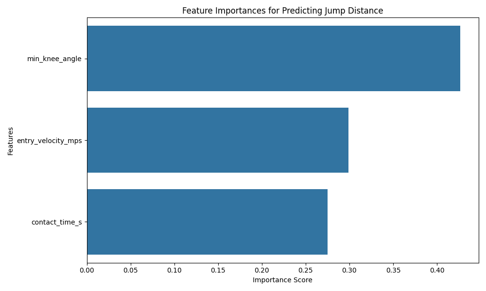

# Leaper: A Biomechanical Analysis Tool for the Triple Jump


## Overview

Leaper is a computer vision and machine learning tool designed to provide a quantitative biomechanical analysis of an athlete's triple jump from a single, non-standard video. Traditional analysis requires expensive lab equipment or perfectly placed cameras. This project overcomes those limitations by using pose estimation and a regression model to predict the individual phase distances (hop, step, jump) and key performance metrics from broadcast footage.

The primary goal was to build a tool that could provide actionable insights for athletes and coaches, such as identifying imbalances in phase distances or quantifying the impact of entry velocity on performance.

---

## Key Features

* **Automated Landmark Extraction:** Uses MediaPipe to extract 2D pose data from video clips.
* **Intelligent Velocity Calculation:** Implements a novel 4-point calibration method to calculate an athlete's true entry velocity in m/s, correcting for camera pan.
* **Biomechanical Feature Engineering:** Calculates key performance indicators inspired by professional biomechanical analysis, including ground contact time and minimum knee angle.
* **Predictive Modeling:** A trained `RandomForestRegressor` model predicts the distance of each phase based on the engineered biomechanical features.
* **Interactive Analysis Tool:** A final script (`analyze_new_jump.py`) allows a user to analyze a new jump by providing the video and manually labeling the phases.

---

## Tech Stack

* **Python:** The core programming language.
* **OpenCV:** For all video processing and interactive calibration.
* **MediaPipe:** For pose estimation and landmark extraction.
* **Pandas & NumPy:** For data manipulation and numerical calculations.
* **Scikit-learn:** For training and evaluating the machine learning model.
* **Matplotlib & Seaborn:** For generating plots and visualizations.

---

## File Structure

The project is organized into a modular structure to separate data, source code, and outputs.

## Setup & Installation

1.  Clone the repository:
    ```bash
    git clone [https://github.com/your-username/Leaper.git](https://github.com/your-username/Leaper.git)
    cd Leaper
    ```
2.  Create and activate a Python virtual environment:
    ```bash
    python -m venv venv
    source venv/bin/activate
    ```
3.  Install the required dependencies:
    ```bash
    pip install pandas numpy opencv-python mediapipe scikit-learn matplotlib seaborn tqdm joblib
    ```

---

## How to Use

The main tool is `analyze_new_jump.py`. To analyze a new jump:

1.  Place your new video clip (e.g., `new_jump.mp4`) inside the `data/raw_videos/` folder.
2.  Run the script from your terminal:
    ```bash
    python analyze_new_jump.py
    ```
3.  The script will guide you through the rest of the process, including:
    * Automatic landmark extraction (if it's the first time).
    * Prompting you for the known total distance and phase frames.
    * An interactive calibration window for the takeoff board and a static point.
    * A final printed report with the predicted phase distances.


## Results & Key Insights

The final model achieved a positive **R² score of 0.283**, indicating it has legitimate predictive power and is significantly better than a baseline guess.

The most interesting finding came from the feature importance analysis. The model determined that the **minimum knee angle** during ground contact was the most important predictor of phase distance, even more so than the athlete's entry velocity. This suggests that the *technique* of how an athlete absorbs and redirects force is a critical factor in performance.



---

## Future Work

* **Increase Dataset Size:** The model's accuracy is primarily limited by the small dataset size. Adding more labeled jumps would be the most effective next step.
* **Automate Phase Detection:** Implement the multi-class classification model to automatically find the start and end of each phase, removing the need for manual frame input.
* **Build a Web Dashboard:** Wrap the analysis tool in a simple web framework like Streamlit to create an interactive dashboard where a user can upload a video and see the results visually.
